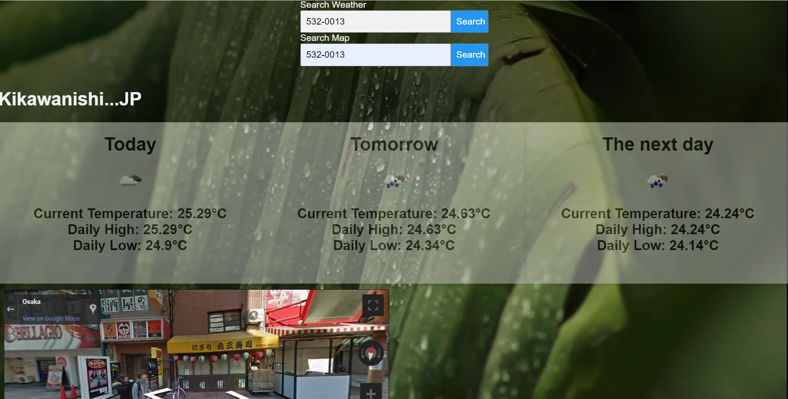

# 3_Day_Forecast
This is a simple web app that gives you a 3 day weather forecast 
for any postal code in Japan. It also allows you to search a map 
on the same page. 

The app uses the OpenWeather [5 day/ 3 Hour Forecast API](https://openweathermap.org/forecast5). Access 
to this API is free but it is not ideal for showing daily high and 
low tempertures because it gives the average high and low temperature
for a 3 hour time period. This API option is ok for demonstration, but 
for production, the paid [Daily Forecast 16 days API](https://openweathermap.org/forecast16) option is better.

I used PHP to get and display the weather forecast. I used JavaScript
provided in the Google API documentation for the map. Unfortunately, I 
was not able to get the weather forecast and the map to load on the same 
click. If anyone reading this has any input about how to fix this problem, 
feel free. 

I developed and tested this using xampp. The background image was sourced from [Pexels](https://www.pexels.com/).

